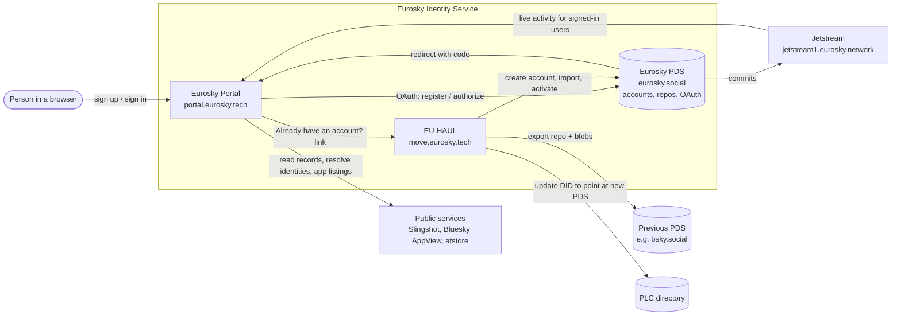

# Eurosky Portal

The Eurosky Portal is the web front door to a Eurosky account. It is where people sign up, sign in, accept the terms of service, see their recent activity across AT Protocol apps, and discover apps they can use with their Eurosky identity.

The Portal is one of three components that together make up the **Eurosky Identity Service**:

| Component                                                    | What it does                                                                                                                            | Where it runs         |
| ------------------------------------------------------------ | --------------------------------------------------------------------------------------------------------------------------------------- | --------------------- |
| **[Eurosky PDS](https://github.com/eurosky-social/atproto)** | The AT Protocol Personal Data Server. Hosts accounts and their data repositories, and acts as the OAuth authorization server.           | `eurosky.social`      |
| **Eurosky Portal** (this repo)                               | Account dashboard and onboarding. An AT Protocol OAuth client of the PDS; holds no passwords and no user content of its own.            | `portal.eurosky.tech` |
| **[EU-HAUL](https://github.com/eurosky-social/eu-haul)**     | Migration tool that moves an existing AT Protocol account (for example from Bluesky) to the Eurosky PDS, keeping the same DID and data. | `move.eurosky.tech`   |

- [Architecture overview](#architecture-overview)
- [Quickstart (local development)](#quickstart-local-development)
- [Running with Docker](#running-with-docker)
- [Configuration](#configuration)
- [Contributing](#contributing)
- [Security](#security)
- [License and branding](#license-and-branding)

## Architecture overview



### How the three components fit together

**1. New accounts: Portal → PDS.** When someone chooses "Create account", the Portal starts an AT Protocol OAuth flow against the configured PDS (`OAUTH_SERVICE`) using the PDS's registration endpoint. The account itself, including the password and handle, is created on the PDS. The Portal never sees the password. Once the person is redirected back, the Portal records the account's DID, handle and the time the terms were accepted in its own small database.

**2. Existing AT Protocol accounts: Portal → EU-HAUL → PDS.** People who already have an account elsewhere (typically on Bluesky) should not create a second identity. The sign-up and sign-in pages link to EU-HAUL (`MIGRATION_SERVICE`). EU-HAUL creates a deactivated account on the Eurosky PDS, copies the repository, media and preferences from the old PDS, updates the PLC directory so the DID points at the Eurosky PDS, and then activates the new account. After migration the person signs in to the Portal like any other Eurosky user, with the same DID, handle and followers they had before. EU-HAUL is a separate Rails application in its own repository; the Portal only links to it.

**3. Signing in: Portal ↔ PDS.** Sign-in is AT Protocol OAuth (with granular scopes) using [`@thisismissem/adonisjs-atproto-oauth`](https://github.com/thisismissem/adonisjs-atproto-oauth). The Portal resolves the handle or DID, checks that its authorization server is the configured Eurosky PDS (unless `ALLOW_EXTERNAL_LOGINS=true`), and redirects the person to the PDS to approve. OAuth session tokens are stored server-side in the Portal's database; the browser only holds an encrypted session cookie. By default the Portal asks for the minimum scopes; extra scopes (for example writing an app "favorite" record) are requested step by step when a feature needs them.

**4. Showing activity: PDS → Jetstream → Portal.** The Portal shows a person's recent posts, likes, follows and long-form documents. On first sign-in a background job backfills recent records by reading them directly from the person's PDS (located via the Slingshot identity resolver). After that, the Portal subscribes to a Jetstream firehose and mirrors new commits for signed-in users. Only a bounded preview of recent records is cached; the PDS remains the source of truth.

**5. App discovery.** The apps directory is a curated list in [`shared/apps.ts`](shared/apps.ts). Names, icons and descriptions are fetched from [atstore](https://atstore.fyi), and favorites are written as `fyi.atstore.listing.favorite` records into the person's own repository on their PDS.

### Inside the Portal

The Portal is a single [AdonisJS](https://adonisjs.com) application with a React front end rendered through [Inertia](https://inertiajs.com) (server-side rendering included). It runs as one process and one container:

- **HTTP server**: routes in [`start/routes.ts`](start/routes.ts), controllers in [`app/controllers`](app/controllers).
- **Database**: SQLite (via Lucid and `better-sqlite3`) for accounts, OAuth state and sessions, cached activity, the cache store and the job queue. Migrations live in [`database/migrations`](database/migrations).
- **Background work**: the queue worker ([`providers/queue_worker_provider.ts`](providers/queue_worker_provider.ts)) and the Jetstream subscriber ([`providers/jetstream_provider.ts`](providers/jetstream_provider.ts)) start inside the web process.
- **Front end**: pages and components in [`inertia/`](inertia), built with Vite and Tailwind CSS.
- **Lexicons**: AT Protocol schemas the Portal uses are pinned in [`lexicons.json`](lexicons.json) and compiled into typed clients in [`app/lexicons`](app/lexicons).
- **Observability** (optional): OpenTelemetry tracing and Plausible analytics, both off by default.

See [CONTRIBUTING.md](CONTRIBUTING.md#project-layout) for a fuller map of the codebase.

## Quickstart (local development)

You need Node.js 24 (see [`.node-version`](.node-version)) and pnpm via Corepack.

```sh
git clone https://github.com/eurosky-social/eurosky-portal.git
cd eurosky-portal
corepack enable
pnpm install
cp .env.example .env
node ace generate:key   # writes APP_KEY into .env
pnpm db:migrate
pnpm dev
```

Then open <http://127.0.0.1:4075>. The development config signs in against a test PDS and allows accounts from any PDS, so you can sign in with an existing AT Protocol account. [CONTRIBUTING.md](CONTRIBUTING.md) covers the full development workflow, checks and how to submit changes.

## Running with Docker

Build an image:

```sh
docker build -f Dockerfile -t ghcr.io/eurosky-social/eurosky-portal:dev .
```

Run it:

```sh
cp .env.docker.example .env.docker.local
docker run -p 4075:4075 --rm --env-file .env.docker.local ghcr.io/eurosky-social/eurosky-portal:dev
```

Pre-built images are published to `ghcr.io/eurosky-social/eurosky-portal` (`dev` tracks `main`; version tags and `latest` are published on release). An example production setup with Caddy and automatic updates is in [`service/`](service).

## Configuration

Configuration is read from environment variables and validated at start-up in [`start/env.ts`](start/env.ts).

| Variable                        | Required | Description                                                                                                                                                          |
| ------------------------------- | -------- | -------------------------------------------------------------------------------------------------------------------------------------------------------------------- |
| `APP_KEY`                       | yes      | Secret used to encrypt cookies and sessions. Generate with `node ace generate:key` or `openssl rand -hex 32`.                                                        |
| `APP_URL`                       | yes      | Public URL of the Portal. Must match the URL in the browser for OAuth to work.                                                                                       |
| `APP_ENV`                       | yes      | `development`, `staging` or `production`.                                                                                                                            |
| `HOST`, `PORT`                  | yes      | Address the server listens on (default port `4075`).                                                                                                                 |
| `OAUTH_SERVICE`                 | yes      | URL of the PDS / OAuth authorization server accounts are created on and signed in to.                                                                                |
| `MIGRATION_SERVICE`             | no       | URL of an EU-HAUL instance. When set, sign-up and sign-in pages offer migration for existing accounts.                                                               |
| `ALLOW_EXTERNAL_LOGINS`         | no       | When `true`, accounts hosted on any PDS may sign in. Defaults to `false` (only `OAUTH_SERVICE` accounts).                                                            |
| `ATPROTO_HANDLE_DOMAIN`         | no       | Handle domain(s) of accounts on the PDS, comma-separated (for example `eurosky.social`). The first completes bare usernames, so people can type just their username. |
| `ATPROTO_RESOLVE_TIMEOUT`       | no       | Milliseconds allowed to resolve an identity, such as a custom handle (default `5000`).                                                                               |
| `ATPROTO_OAUTH_CLIENT_ID`       | no       | URL of the OAuth client metadata document. Leave unset in local development.                                                                                         |
| `ATPROTO_OAUTH_JWT_PRIVATE_KEY` | no       | Private key for running as a confidential OAuth client.                                                                                                              |
| `DATABASE_PATH`                 | no       | SQLite file path. Defaults to `tmp/db.sqlite3`.                                                                                                                      |
| `DATABASE_AUTOMIGRATE`          | no       | Run pending migrations on start-up. Used in the Docker image.                                                                                                        |
| `SESSION_DRIVER`                | yes      | `cookie` (default), `memory` or `database`.                                                                                                                          |
| `OTEL_ENABLED`                  | no       | Enable OpenTelemetry. Configure the exporter with the standard `OTEL_EXPORTER_OTLP_*` variables.                                                                     |
| `PLAUSIBLE_ENABLED`             | no       | Send privacy-friendly analytics events to Plausible.                                                                                                                 |

## Contributing

Contributions are welcome. Please read [CONTRIBUTING.md](CONTRIBUTING.md) for setup, coding conventions and the pull request process, and follow our [Code of Conduct](CODE_OF_CONDUCT.md).

## Security

Please do not report vulnerabilities in public issues. See [SECURITY.md](SECURITY.md) for how to report them privately.

## License and branding

The source code is released under the [MIT License](LICENSE). The Eurosky name, logo and branding, and the Eurosky terms of service and privacy notice, are **not** covered by that license. If you deploy or fork the Portal, read [trademarks.md](trademarks.md) first: you must use your own branding, legal documents and infrastructure.
